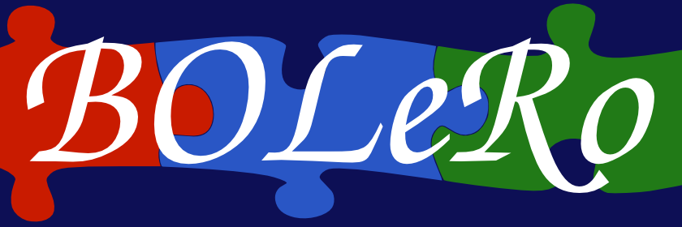

# BOLeRo

BOLeRo (Behavior Learning and Optimization for Robots) provides tools to learn
behaviors for robots. That includes behavior representations as well as
reinforcement learning, black-box optimization, and evolutionary algorithms and
imitation learning. It provides a C++ and a Python interface to be efficient
where this is required and to be flexible and convenient where performance is
not an issue. Because the library provides a C++ interface, it is easy to
integrate in most robotic frameworks, e.g. the robot operating system (ROS) or
the robot construction kit (Rock).

## Installation

In order to install all dependencies and BOLeRo you can use the installation
script

    wget https://raw.githubusercontent.com/rock-learning/bolero/master/bootstrap_bolero.sh
    chmod +x bootstrap_bolero.sh
    ./bootstrap_bolero.sh

## Documentation

The documentation can be built in the directory `doc/` with `make`. It will
be located in `doc/build/html/index.html`. Building the documentation requires
[doxygen](http://www.stack.nl/~dimitri/doxygen/) and
[sphinx](http://sphinx-doc.org/).

## Directories

BOLeRo contains the following directories:

* benchmarks - contains benchmark scripts or scripts that reproduce results
  from scientific papers
* bolero - contains the Python library
* doc - contains the documentation
* examples - contains examples that demonstrate how to use bolero
* include - contains the header files that define the C++ interfaces
* src - contains several C++ packages

## License

BOLeRo is distributed under the
[3-clause BSD license](https://opensource.org/licenses/BSD-3-Clause).
