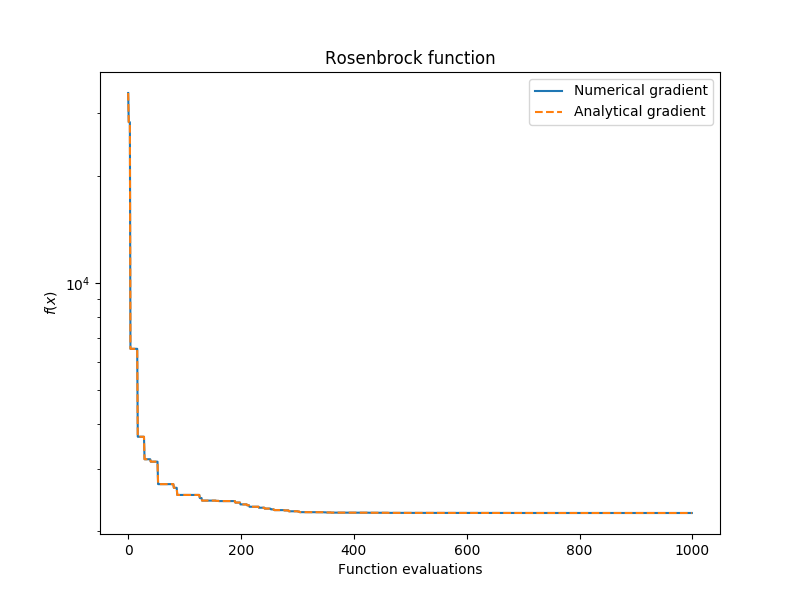
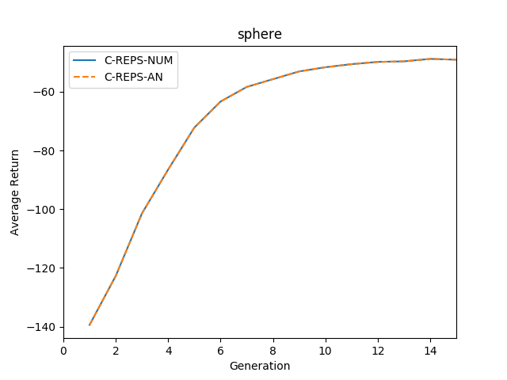

# Comparing numerical and analytical gradients for REPS and C-REPS

The two benchmark scripts *reps_benchmark.py* and *creps_benchmark.py* compare the performance of using analytical gradients rather than numerical gradients when minimizing the dual function.

For both REPS and C-REPS the analytical gradient implementation leads to:
 * Better runtime performance.
 * Similar stability.
 * In some occasions very slightly improved solutions.


 ## Benchmarks results:

 ```
$ python reps_benchmark.py
Numerical gradient: completed in average time of 0.69 seconds.
Numerical gradient: minimum found was 2252.771314.
Analytical gradient: completed in average time of 0.62 seconds.
Analytical gradient: minimum found was 2252.769558.
 ```



```
$ python creps_benchmark.py
...
C-REPS-NUM (objective function sphere): completed in average time of 9.892 seconds.
...
C-REPS-AN (objective function sphere): completed in average time of 7.184 seconds.
C-REPS-NUM (objective function sphere): maximum found was -48.828993.
C-REPS-AN (objective function sphere): maximum found was -48.828993.
```


