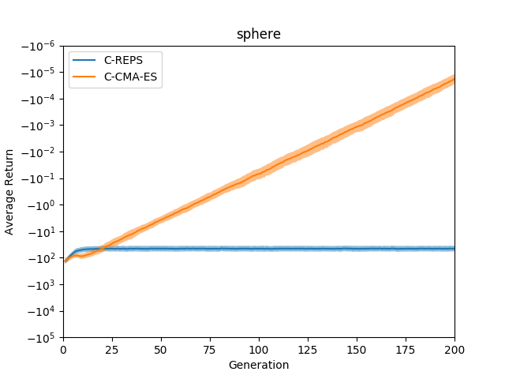
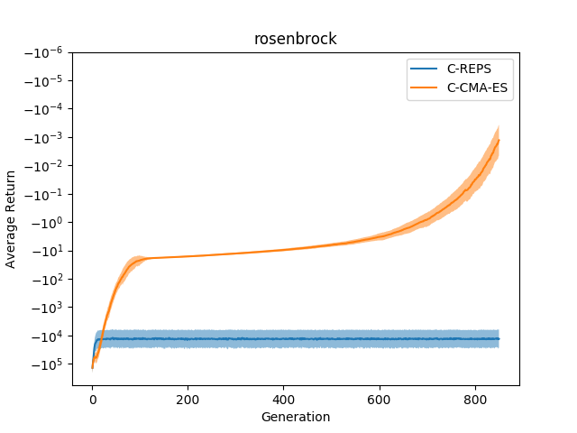

# Contextual Covariance Matrix Adaptation Evolution Strategies

This folder contains a script to reproduce results from Section 6.1 of the paper

Abbas Abdolmaleki, Bob Price, Luis Paulo Reis, Gerhard Neumann:
Contextual Covariance Matrix Adaptation Evolution Strategies
[PDF](http://www.ausy.tu-darmstadt.de/uploads/Site/EditPublication/Abdolmaleki_IJCA2017.pdf)
[supplementary meterial](https:://goo.gl/MLzKsW)

Figures 1 (a) and (b) will be generated by this script. We only evaluate
the methods "Contextual CMAES" and "Contextual REPS" because the other
algorithms are not interesting for us.

The label on the x-axis of the original publications is "Episodes" which is not
correct. The actual label should be "Generations" and each generation contains
50 episodes. The "Average Return" is averaged over all contexts that have been
evaluated in a generation. This is per se instable because the evaluated
contexts change with each generation.

